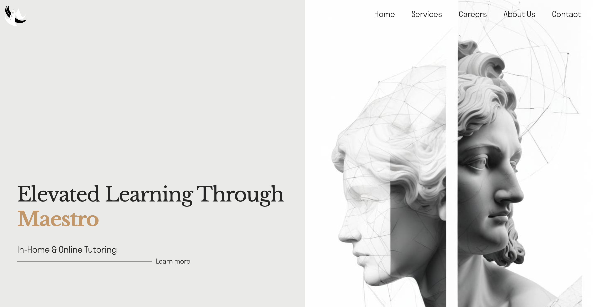

# Maestro - Connecting Tutors with Learners

**Maestro** is a web-based platform designed to connect dedicated tutors with eager learners, fostering academic growth and helping students excel in various subjects. The platform offers flexible learning options and personalized tutoring services to ensure both tutors and students have the best experience.

## Table of Contents

- [About](#about)
- [Features](#features)
- [Technologies Used](#technologies-used)

## About

At **Maestro**, we provide private tutoring across a variety of subjects, including Mathematics, Physics, Biology, Chemistry, and more. Whether you're a tutor ready to make an impact or a student unlocking new possibilities, Maestro simplifies the process of connecting and ensuring reliable, transformative educational experiences. Learners can choose between in-person or online tutoring, based on their preference and convenience.

## Features

- **Tutor Matching**: Efficiently matches students with tutors based on their needs and preferences.
- **Subject Variety**: Tutoring available in core subjects such as Mathematics, Physics, Biology, Chemistry, and more.
- **Flexible Learning**: Students can choose between in-person and online tutoring formats.
- **User-Friendly Interface**: Simple and intuitive design, making it easy for tutors and learners to navigate.
- **Responsive Design**: Ensures seamless use across all devices, from desktops to mobile phones.

## Technologies Used

This project was built using the following technologies:

- React.js (with NextJS as the build tool)
- TypeScript
- Sass (for styling)
- Firebase
